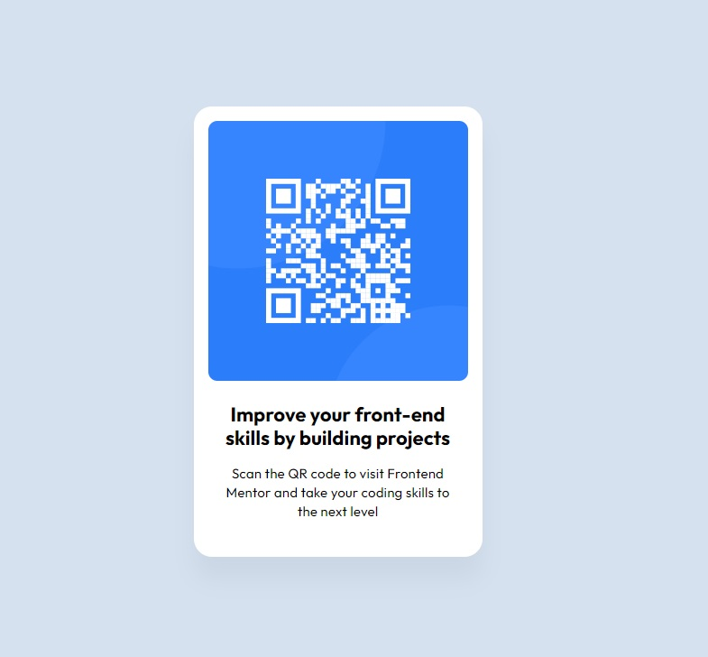

# Frontend Mentor - QR code component solution

This is a solution to the [QR code component challenge on Frontend Mentor](https://www.frontendmentor.io/challenges/qr-code-component-iux_sIO_H). Frontend Mentor challenges help you improve your coding skills by building realistic projects. 

## Table of contents

- [Overview](#overview)
  - [Screenshot](#screenshot)
  - [Links](#links)
- [My process](#my-process)
  - [Built with](#built-with)
  - [What I learned](#what-i-learned)
  - [Continued development](#continued-development)
  - [Useful resources](#useful-resources)
- [Author](#author)
- [Acknowledgments](#acknowledgments)

**Note: Delete this note and update the table of contents based on what sections you keep.**

## Overview

I would appreciate if someone checks, if I have correctly understood section.qr-section parameters both for desctop and mobile.

### Screenshot

### Links

- Solution URL: [solution files](https://github.com/Illia-L/qr-code-component-main)
- Live Site URL: [solution in the browser](https://illia-l.github.io/qr-code-component-main/)

## My process

### Built with

- HTML
- CSS

### What I learned

As for this task, my basic knowledge was enough to solve it.

### Continued development

Now I am attending course on fullstack development. The next few weeks we study css, so, during this time a'm going to practice CSS.

### Useful resources

- [MDN](https://developer.mozilla.org/en-US/) - Not a single step without searching in google and choosing MDN
- [Chat GPT](https://chatgpt.com/) - Copilot for any harder task, like to automate creating repos for tiny projects like this

## Author

Illia Liashko